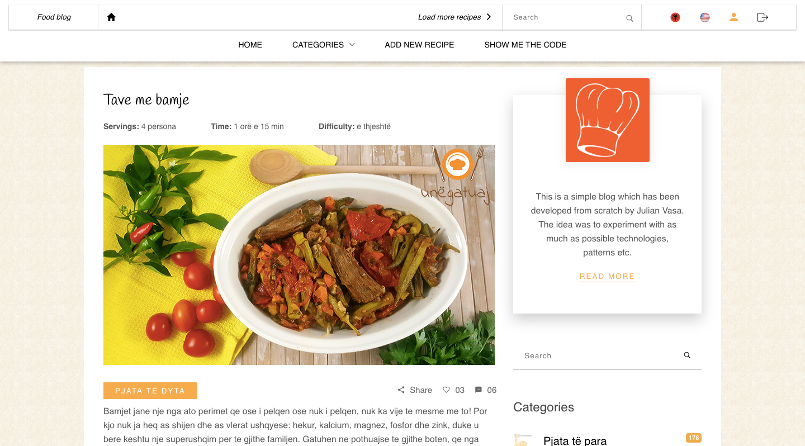

<h2>Food Blog</h2>

Developed a simple blog using:

 - Spring Boot 2
 - Multi Maven Project
 - REST API
 - SOAP API
 - Thymeleaf (hope to integrate also some other template engine)
 - Spring Data
 - Spring Data Rest 
 - Hibernate
 - MySQL DB (hope to integrate also some NoSQL DB in the future)
 - Lombok (because i am lazy and dont like to write getters/setters/constructors etc)
 - Internationalization (EN, AL)
 - Some experiments with Lambda functions
 - Pagination
 - User Login / Registration 
 - Swagger for API Documentation 

The blog has a homepage which displays recent (paginated) recipes. 
The recipes are grouped by categories.
There is a sidebar which shows some recent posts, the categories, a kind of tag cloud, a search.

---

Database setup:
By default the app runs on H2 DB. If you want to switch to MySQL follow the steps below:
 Uncomment the following variables in frontend/application.properties and change IP, PORT and DB_NAME
      
        MySQL
        spring.datasource.url=jdbc:mysql://IP:PORT/DB_NAME?characterEncoding=utf8&verifyServerCertificate=false&useSSL=false&requireSSL=false
        spring.datasource.username=USERNAME
        spring.datasource.password=PASSWORD
        spring.datasource.testWhileIdle=true
        spring.datasource.validationQuery=SELECT 1
        spring.jpa.properties.hibernate.dialect=org.hibernate.dialect.MySQL5InnoDBDialect
        spring.jpa.properties.hibernate.id.new_generator_mappings=false
        spring.datasource.initialization-mode=always
  Uncomment the MySQL dependency in service/pom.xml and comment the H2 dependency 

 ***

 I wasn't able to add swagger-data-rest (Spring Data Rest API Documentation) due to a conflict with spring-data-rest regarding the lib spring-data-commons :(
 
 [REST API Documentation](http://localhost/swagger-ui.html) 
 [SOAP WSDL](http://localhost/ws/categories.wsdl)
 
 The project is ready to be deployed in **Heroku** and **Docker**. 
  
 Please change the `docker.image.prefix` in frontend/Dockerfile and run dockerfile plugin, it will generate an image file that can be deployed in Docker. Docker application should be running before running maven plugin dockerfile.
  
 If you want to deploy it in Heroku or Docker, connect it with a Github repo. 
 
 
